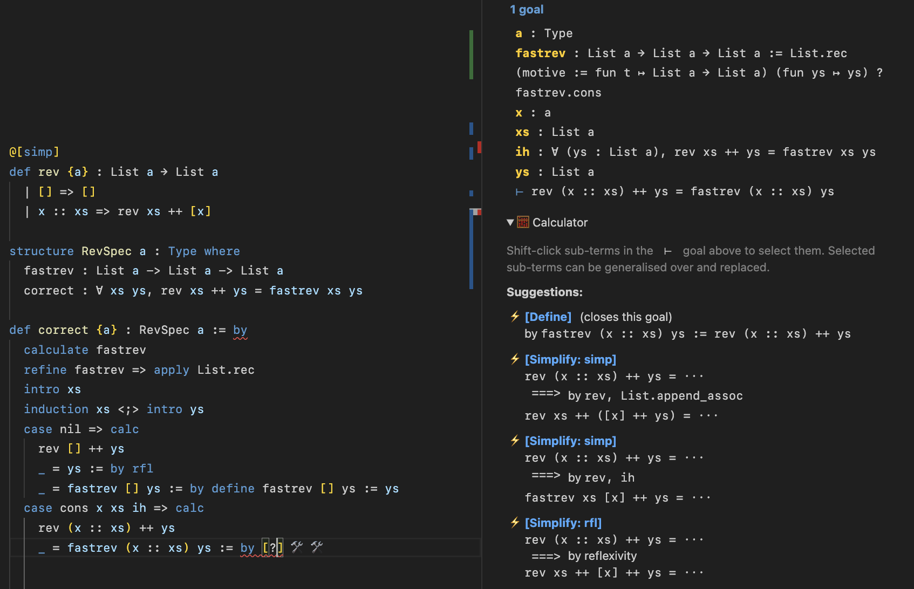

# calculator

New tactics and utilities for calculating programs directly in Lean!

## What is this?

Program calculation (e.g. [[1]](https://zacgarby.co.uk/posts/the-calculated-typer/) [[2]](https://zacgarby.co.uk/posts/calculating-compilers-effectively/) [[3]](https://www.cambridge.org/core/services/aop-cambridge-core/content/view/70AA17724EBCA4182B1B2B522362A9AF/S0956796815000180a.pdf/calculating-correct-compilers.pdf)) is a way of deriving programs (functions, code, etc) which are correct by construction, according to some specification.

---

Okay, that's quite an abstract definition. A nice example is the "fast reverse" function.

It's easy to write this reverse function, and it's the intuitive definition many of us would come up with.

```lean
def rev {a} : List a → List a
  | [] => []
  | x :: xs => rev xs ++ [x]
```

But, it's quite inefficient. Because each step has an append, `++`, this function is `O(n)` in the length of the list.

But it does the right thing. Therefore we can use it as part of a *specification*, and write down an equation. Let's say that we want to **calculate** a new function, `fastrev`, which does the same thing but is faster hopefully.

```
∀ xs ys,  fastrev xs ys  ==  rev xs ++ ys
```

We're generalising the problem a bit, allowing the function an extra argument. This gives is the ability to be `O(1)`, amazingly. Solving this equation, by induction on `xs`, constructs the target program `fastrev` for us quite naturally! (See below, the example, for specifics.)

## Formalising calculations

I've formalised a lot of calculations like this in Agda. There is a problem though. We can't *really* calculate things in Agda, or Lean usually for that matter. We have to define the objects first, and *then* prove things about them. Calculation is all about flipping this on its head.

But Lean, as it happens, still is the perfect vehicle for this. I made some tactics so that we can perform calculations in exactly the same way as we would do with pen and paper.

Take this example, from [Example.lean](Calculator/Example.lean).

```lean
def rev {a} : List a → List a
  | [] => []
  | x :: xs => rev xs ++ [x]

structure RevSpec a : Type where
  fastrev : List a -> List a -> List a
  correct : ∀ xs ys, rev xs ++ ys = fastrev xs ys

def correct {a} : RevSpec a := by
  calculate fastrev
  refine fastrev => apply List.rec
  intro xs
  induction xs <;> intro ys
  case nil => calc
    rev [] ++ ys
    _ = ys := by rfl
    _ = fastrev [] ys := by define fastrev [] ys := ys
  case cons x xs ih => calc
    rev (x :: xs) ++ ys
    _ = rev xs ++ [x] ++ ys := by rfl
    _ = rev xs ++ ([x] ++ ys)
      := by simp only [List.append_assoc]
    _ = fastrev xs ([x] ++ ys) := by rw [ih]
    _ = fastrev xs (x :: ys) := by rfl
    _ = fastrev (x :: xs) ys
      := by define fastrev (x :: xs) ys := fastrev xs (x :: ys)
```

The new tactics are:

 - `calculate (ident,*)` is a little like `constructor`. It deconstructs the goal's fields and introduces a goal for each. But importantly, for the fields named in the tactic (here `fastrev`) are instantiated and named as metavariables, and introduced into the equation(s)'s local hypothesis. That is, the goal state after that line is:

    ```
    (2 goals)
    case correct
    a : Type
    fastrev : List a → List a → List a := ?fastrev
    ⊢ ∀ (xs ys : List a), rev xs ++ ys = ?fastrev xs ys

    case fastrev
    a : Type
    ⊢ List a → List a → List a
    ```

 - `refine` lets us refine one of these calculation goals, such as `fastrev`, via some other tactic(s). Here, we apply `List.rec`, the recursor eliminator for lists (i.e. the dependent version of fold). This transforms our second goal into two:

    ```
    (3 goals)
    case correct
    a : Type
    fastrev : List a → List a → List a
      := List.rec ?fastrev.nil ?fastrev.cons
    ⊢ ∀ (xs ys : List a), rev xs ++ ys = fastrev xs ys

    case fastrev.nil
    a : Type
    ⊢ List a → List a

    case fastrev.cons
    a : Type
    ⊢ a → List a → (List a → List a) → List a → List a
    ```

    As we can see, we now have these two cases `nil` and `cons`, and `fastrev` is now defined as `List.rec ?fastrev.nil ?fastrev.cons`. That is: it's a function defined recursively over lists. This is generally an assumption we want to make.

 - The calculations then use the `calc` tactic, which is standard Lean, although beefed up here (see below).
  

 - `define` assigns one of these sub-goals like `fastrev.nil` or `fastrev.cons` via a natural pattern-matching function-definition syntax. It allows us to define each clause of the functions **midway through the proof itself**.

    For example, it allows us to close the following goal in the `nil` case:

    ```
    a : Type
    fastrev : List a → List a → List a
      := List.rec ?fastrev.nil ?fastrev.cons
    ys : List a
    ⊢ ys = fastrev [] ys
    ```

## Calculation helper widget

There's also a cool widget! When you're constructing a calculation, Lean will now show this widget suggesting possible next steps.



Like seriously, how cool is this?? And you can just click the button and it applies it to your file in real-time!

It's very extensible, and you can make your own "suggesters". It can do a lot already though. Simplification, new function clause definitions, applying lemmas (even from libraries), applying local hypothesis (e.g. induction hypotheses), arbitrary subterm rewriting/replacement, even adding new **type constructors** to inductive type definitions.

In fact, it's able to entirely mechanically calculate the fast reverse function above.

## Another example: calculating a compiler

A classic calculation from e.g. [[3]](https://www.cambridge.org/core/services/aop-cambridge-core/content/view/70AA17724EBCA4182B1B2B522362A9AF/S0956796815000180a.pdf/calculating-correct-compilers.pdf), we can calculate a compiler, a virtual machine, and an instruction set, from a specification consisting of an `Exp`ression type and an `eval` semantics for it.

```lean
inductive Exp : Type
  | val : Nat -> Exp
  | add : Exp -> Exp -> Exp
  deriving BEq

compile_inductive% Exp

@[simp]
def eval : Exp -> Nat
  | .val n => n
  | .add x y => eval x + eval y

inductive Code where
  | push : ℕ → Code → Code
  | add : Code → Code
  | halt : Code

compile_inductive% Code

abbrev Stack := List Nat

structure CompSpec where
  comp : Exp -> Code -> Code
  exec : Code -> Stack -> Stack
  correct : ∀ e c s, exec c (eval e :: s) = exec (comp e c) s

def comp_calc : CompSpec := by
  calculate comp, exec
  refine comp => apply Exp.rec
  refine exec => apply Code.rec
  intro e
  induction e <;> intros c s
  -- Case val n:
  case val n => calc
    exec c (eval (Exp.val n) :: s)
    _ = exec c (n :: s) := by rfl
    _ = exec (Code.push n c) s
      := by define exec (Code.push n c) s := exec c (n :: s)
    _ = exec (comp (Exp.val n) c) s
      := by define comp (Exp.val n) c := (Code.push n c)
  case add x y ih_x ih_y => calc
    exec c (eval (Exp.add x y) :: s)
    _ = exec c ((eval x + eval y) :: s) := by rfl
    _ = exec (Code.add c) (eval x :: eval y :: s)
      := by define exec (.add c) s := match s with
          | (m::n::s) => exec c ((m + n) :: s)
          | _ => don't care
    _ = exec (comp x (Code.add c)) (eval y :: s) := by simp only [ih_x]
    _ = exec (comp y (comp x (Code.add c))) s := by simp only [ih_y]
    _ = exec (comp (Exp.add x y) c) s
      := by define comp (Exp.add x y) c := comp y (comp x (Code.add c))
  case halt =>
    exact id
```

This, to me, looks practically identical to what I'd write by hand! And it's almost all automatic, and all formally verified!